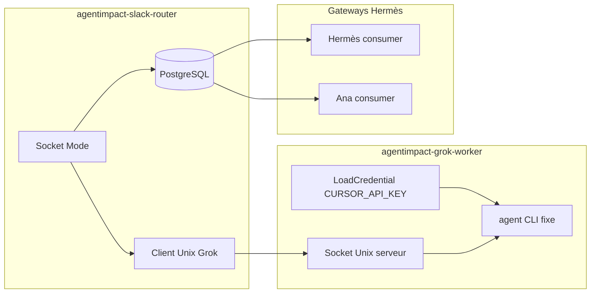

# Routeur Slack AgentImpact v1

Worktree : `/opt/agentimpact/runner/worktrees/slack-grok-router-v1`  
Branche : `feature/slack-grok-router-v1` (non commitée)

## Architecture deux services



### Utilisateurs systemd

| Service | User | Group | Secrets |
| --- | --- | --- | --- |
| `agentimpact-slack-router` | `agentimpact-slack-router` | `agentimpact-slack-router` + `agentimpact-grok-client` | Tokens Slack uniquement |
| `agentimpact-grok-worker` | `cursor-grok-worker` | `cursor-grok-worker` | `CURSOR_API_KEY` via LoadCredential |

**Le routeur ne charge jamais `CURSOR_API_KEY`** — garde `assertRouterHasNoCursorKeyEnv()` au démarrage.

### Socket Unix Grok

| Paramètre | Valeur |
| --- | --- |
| Chemin | `/run/agentimpact-grok-worker/grok.sock` |
| Owner | `cursor-grok-worker` |
| Group | `agentimpact-grok-client` |
| Mode | `0660` |
| Protocole | JSON ligne `{ v, id, prompt }` → `{ v, id, ok, text? }` |

#### Source d'autorité pour `/run/agentimpact-grok-worker`

| Couche | Rôle |
| --- | --- |
| **`agentimpact-grok-worker.socket`** | **Autorité runtime** — crée le répertoire (`DirectoryMode=0750`), le socket (`SocketMode=0660`, `SocketUser`/`SocketGroup`) et conserve le descripteur ouvert pour les connexions successives du routeur. |
| `agentimpact-slack-router.tmpfiles.conf` | Amorçage au boot uniquement — mêmes owner/group/mode (`0750 cursor-grok-worker agentimpact-grok-client`) ; ne remplace pas l'unité socket une fois systemd actif. |
| `agentimpact-grok-worker.service` | **Sans `RuntimeDirectory`** — le worker consomme le socket via activation socket (`Service=` côté `.socket`, `Requires=`/`After=` côté service ; `TriggeredBy=` est calculé par systemd, jamais déclaré manuellement) et ne doit jamais reprendre la propriété du répertoire (évite un groupe `cursor-grok-worker` qui bloquerait `agentimpact-slack-router`). |

Le routeur dépend uniquement de `agentimpact-grok-worker.socket` (`Requires=`, pas le service worker) et accède au socket via `SupplementaryGroups=agentimpact-grok-client`.

Options agent **fixées côté worker** : `cursor-grok-4.6-medium`, mode `ask`, `single-turn`, timeout 300s, concurrence max 1.

## Persistance PostgreSQL (migration 002)

| Table | Rôle |
| --- | --- |
| `slack_event_dedup` | PK `(team_id, event_id)` — dedup survive redémarrage |
| `slack_thread_owners` | PK `thread_key`, UNIQUE `(team_id, channel_id, thread_root_ts)` — ownership immuable |
| `slack_gateway_inbox` | Inbox Hermès/Ana — pending → processing → done/failed |
| `slack_router_runs` | Audit |

Transaction atomique avant délégation agent : dedup + ownership en une transaction ; fail-closed si Postgres indisponible.

## Relais Hermès / Ana (inbox réelle)

Pas d'URL HTTP fictive. Mécanisme :

1. Routeur insère dans `slack_gateway_inbox` (target `hermes` ou `ana`).
2. Consumers long-running `gateway-inbox-consumer.py --loop` (systemd) :
   - `agentimpact-gateway-inbox-hermes.service` (profil `default`)
   - `agentimpact-gateway-inbox-ana.service` (profil `agentimpact-growth`)
   - Token bridge via LoadCredential (`gateway-inbox-bridge-token`)
   - Backoff borné 1–30 s, arrêt propre SIGTERM
   - `POST /api/gateway-inbox/claim` (token bridge, localhost)
   - Exécute Hermès via `run-with-profile.sh` + profil
   - `POST /api/gateway-inbox/:id/complete`
3. Routeur poll Postgres jusqu'à réponse ou timeout (fail-closed).

Profils consumer :

| Target | `GATEWAY_INBOX_TARGET` | `HERMES_PROFILE` |
| --- | --- | --- |
| Hermès | `hermes` | `nadir-operator` (→ Hermès interne `default`) |
| Ana | `ana` | `agentimpact-growth` |

## Devin v1

`ESCALADE DEVIN` → **« Escalade non configurée. »** — aucun lancement Devin.

## Prompt `/proc`

Wrapper `grok-agent-run.sh` : prompt via fichier éphémère puis argument positionnel.  
**Mitigation** : processus court (timeout 300s), worker isolé, permissions socket strictes.  
**Limite** : visible dans `/proc/<pid>/cmdline` pendant l'exécution — pas de contournement sans API stdin Cursor.

## Build hôte requis

Les services systemd lisent `/opt/agentimpact/app/dist/` sur l'hôte.
Le playbook `hermesctl-v1.yml` exécute `npm ci && npm run build` en tant que
`agentimpact-runner` après sync du code — indépendamment du build conteneur API.

## Prérequis Grok

Voir `docs/grok-worker-prerequisites.md` — CLI Cursor installé manuellement,
jamais téléchargé par le playbook.

## Rollback

Playbook `slack-grok-router-v1-rollback.yml` : kill switch + stop services +
restauration bundle (dist, scripts, unités, tmpfiles, configs). Tables SQL et
credentials préservés.

## Tests

```bash
cd src && npm run build && npm run lint && npm test
npm run lint:md   # depuis src/
ansible-playbook ... --syntax-check
```
